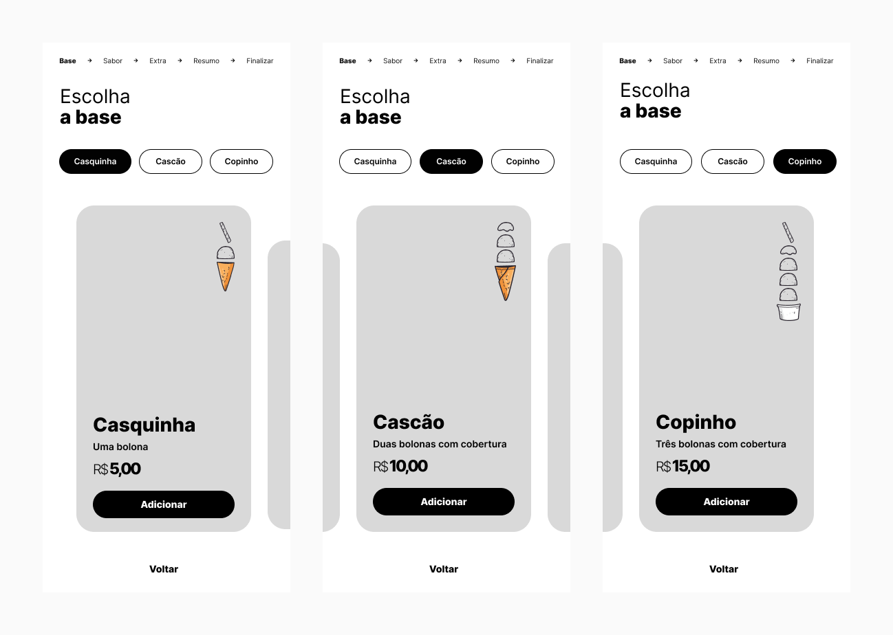
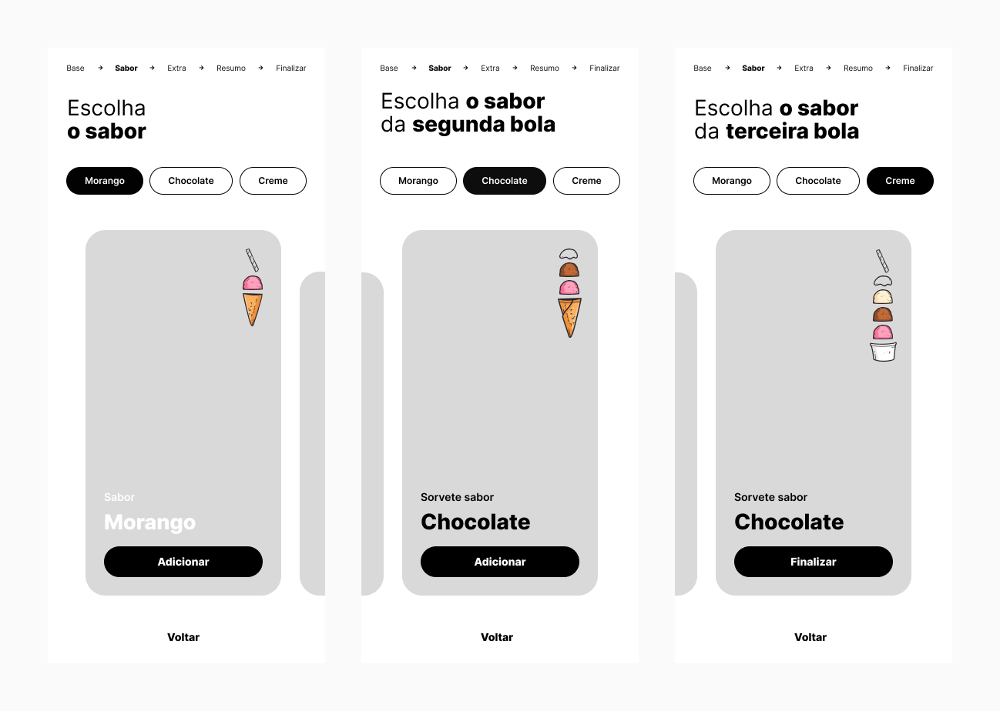
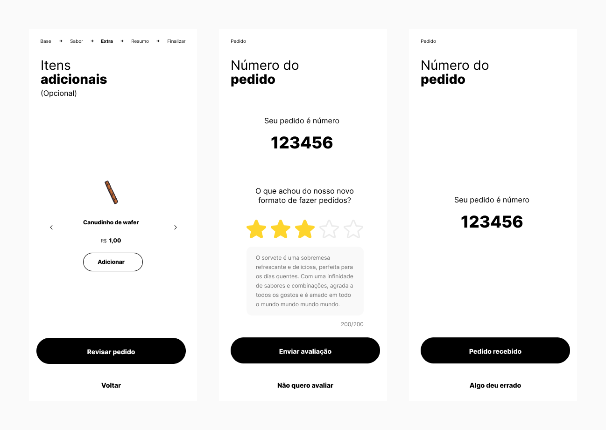

# Bolona

## Descrição
Bolona é uma aplicação web para autoatendimento em sorveterias onde o usuário escolhe a base (casquinha, cascão ou copinho) e personaliza seu sorvete com diferentes sabores e adicionais. A aplicação implementa regras específicas para cada base, e usa React com TypeScript para proporcionar uma experiência de usuário dinâmica e interativa.

## Recursos
Escolha entre diferentes bases (casquinha, cascão e copinho).
Escolha sabores e adicionais.
Existe regras específicas para cada base de sorvete.
Interface amigável e responsiva, porém pensada para dispositivos móveis.
Funcionalidades dinâmicas utilizando Context API para gerenciamento de estado.
Filtragem dinâmica de itens com base na escolha do usuário.
Implementação de gráficos dinâmicos para visualização de estados.

## Instalação
Clone o repositório:
```git clone https://github.com/portellaluana/bolona-web-app.git```

Instale as dependências:
```npm install```

Inicie a aplicação:
```npm run dev```

## Como usar
Escolha a base do sorvete (casquinha, cascão ou copinho).
Selecione os sabores e adicionais.
Visualize o resumo do pedido na página de resumo.
Finalize o pedido.

## Tecnologias Utilizadas
React: Biblioteca JavaScript para construção de interfaces de usuário.
TypeScript: Superset do JavaScript que adiciona tipos estáticos ao código.
Context API: Gerenciamento de estado global para a aplicação React.
CSS Modules: Estilos locais e encapsulados para os componentes.
Jest: Framework de testes para JavaScript e React.
Swiper: Biblioteca para carrosséis responsivos.
PWA: Implementação de Progressive Web App, permitindo que a aplicação seja instalada em dispositivos móveis e funcione offline.

## Componentes Principais
BaseSelection
Gerencia a escolha da base do sorvete e aplica as regras correspondentes.

FlavorSelection
Permite a seleção de sabores e adicionais, adaptando as opções conforme a base escolhida.

Summary
Exibe um resumo completo do pedido, incluindo todos os sabores e adicionais selecionados.

Shared
Componentes e utilitários reutilizáveis, como botões e ícones.

## Context API
A Context API é usada para gerenciar o estado da aplicação de forma centralizada.
O estado é dividido em vários contextos para facilitar a manutenção e escalabilidade, incluindo:

BaseContext: Gerencia a seleção da base.
FlavorContext: Gerencia os sabores e adicionais.
OrderContext: Armazena o estado do pedido completo.

## Testes
A aplicação inclui testes unitários e de integração usando Jest.
Os testes estão localizados na pasta tests/.

Para rodar todos os testes:
```npm test```

## Screenshots
Página inicial


Escolhendo a base


Escolhendo sabores das respectivas bases onde casquinha recebe uma bola, cascão duas e copinho três


Tela de itens extra e aguardando pedido ser preparado

